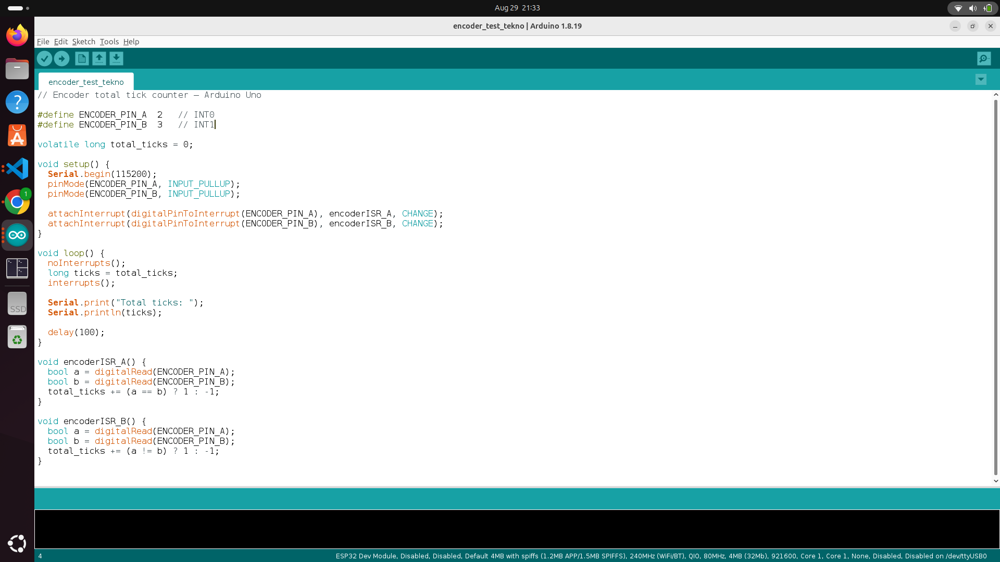
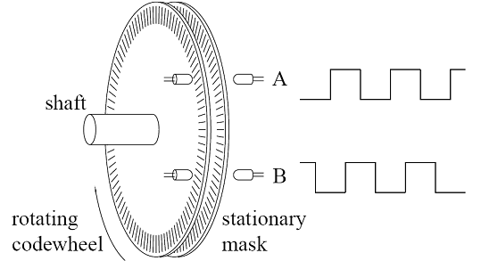

# Encoders

We use Encoders to give us a feedback about our motion to know the Distance we Moved. And the Dierction we move is it Forward or Backward.

_1200x630.jpg.webp)

## Types of Encoders 

there are many types of Encoders Like : 

1- Incremental

2- Absolute

## Connection :

as We see the Encoder have **four Wires** : 

1- Red >>>>>>>>>>> **Vcc** 5volt

2- Black >>>>>>>>> **GND**

3- Green >>>>>>>>> **phase A**

4- White >>>>>>>>> **Phase b**

There is a Grey Wire but we dont use it called the Shield 


if we connect one instead of the other in phases we can flip them , we will know if we rotate the Wheel Forward and it decreases the Count 


## After you Connected it Open **Arduino IDE** and choose the Board Arduino uno and change it if it is not uno




## Here is A sample code to test the Encoders :

```
// Encoder total tick counter — Arduino Uno

#define ENCODER_PIN_A  2   // INT0
#define ENCODER_PIN_B  3   // INT1

volatile long total_ticks = 0;

void setup() {
  Serial.begin(115200);
  pinMode(ENCODER_PIN_A, INPUT_PULLUP);
  pinMode(ENCODER_PIN_B, INPUT_PULLUP);

  attachInterrupt(digitalPinToInterrupt(ENCODER_PIN_A), encoderISR_A, CHANGE);
  attachInterrupt(digitalPinToInterrupt(ENCODER_PIN_B), encoderISR_B, CHANGE);
}

void loop() {
  noInterrupts();
  long ticks = total_ticks;
  interrupts();

  Serial.print("Total ticks: ");
  Serial.println(ticks);

  delay(100);
}

void encoderISR_A() {
  bool a = digitalRead(ENCODER_PIN_A);
  bool b = digitalRead(ENCODER_PIN_B);
  total_ticks += (a == b) ? 1 : -1;
}

void encoderISR_B() {
  bool a = digitalRead(ENCODER_PIN_A);
  bool b = digitalRead(ENCODER_PIN_B);
  total_ticks += (a != b) ? 1 : -1;
}
```
## How it Works :

The encoder disk has a series of evenly spaced slots cut into it. On one side of the disk sits an LED; on the other side sits a light receiver (phototransistor). As the encoder shaft turns, each slot alternately lets light through to the receiver and then blocks it, producing a square-wave HIGH/LOW electrical signal.


The encoder has two such LED/receiver pairs — channel A and channel B — positioned slightly offset from one another around the disk (a quarter of a slot-pitch apart). This physical offset between A and B is what makes direction detection possible; a single channel alone can only tell you that the shaft moved, not which way.




### Signal behavior

As a slot passes a channel's sensor:

Light gets through → the signal reads 1
The slot moves on and the disk blocks the light again → the signal reads 0

Because A and B are offset, they don't flip at the same instant — one of them always changes slightly before the other, and which one leads depends on the direction of rotation.

How direction is detected

Two interrupts are used, one per channel, each set to fire on any change (CHANGE — both 0→1 and 1→0 edges). Each interrupt handler reads both channels' current states and applies a comparison rule:

**When channel A changes:**

A vs B	Meaning	Tick count

Equal (A == B)	Moving forward	+1

Not equal (A != B)	Moving backward	−1

**When channel B changes:**

A vs B	Meaning	Tick count

Not equal (A != B)	Moving forward	+1

Equal (A == B)	Moving backward	−1


## Some note :

As we know we use the interrupt pins in the Ardunio Uno (2,3) and on mega 2,3,18,19,20,21

Why not just poll a regular digital pin instead?

You could read a normal digital pin with digitalRead() inside loop(), but that brings back the exact problem we covered earlier: polling only checks at fixed moments. An encoder can spin fast enough to flip states between your checks, and you'd silently miss ticks — your count would drift and become inaccurate. That's precisely why encoders are almost always wired to interrupt-capable pins: you need the "wakes up the instant it changes" behavior, not "checks periodically and hopes it caught it.


All CopyRights For MindCloud Team, Alexandria Universty 
